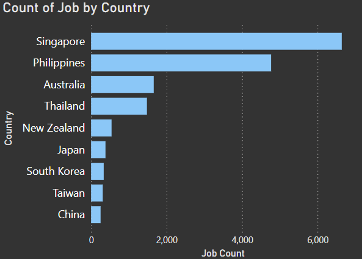
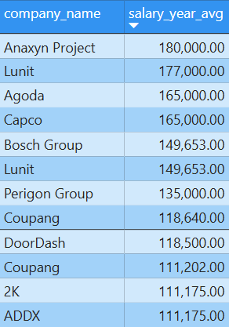
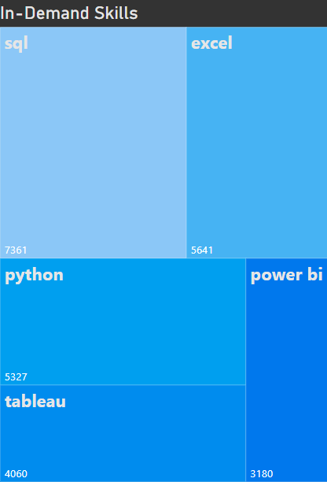
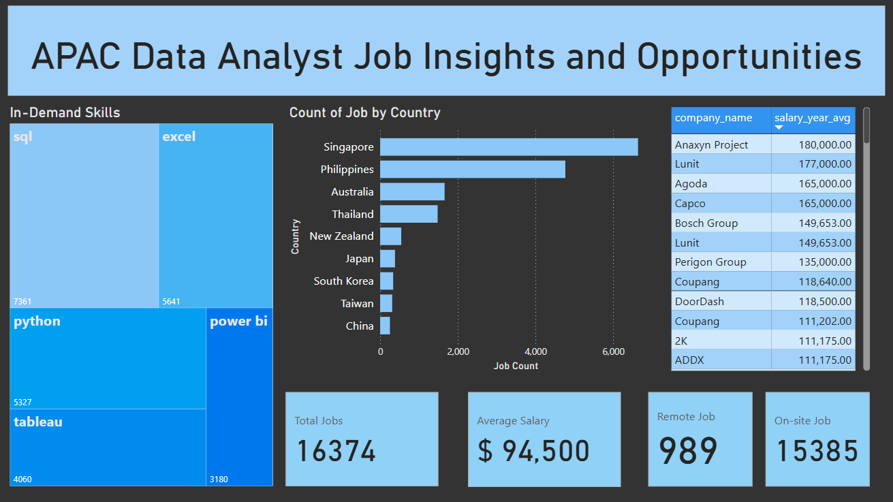

# Introduction
Data Analyst Job Market Analysis - Asia-Pacific Focus *(Specifically: Singapore, Thailand, Philippines, Japan, Taiwan, China, South Korea, Australia, New Zealand)*

This project explores the Data Analyst job market in the Asia-Pacific region. It highlights job availability, top-paying companies, in-demand skills, and remote vs on-site work trends. The goal is to help aspiring and current data analysts identify career opportunities and target the most valuable skills.

## Tools Used
- **SQL (PostgreSQL)** - Core tool for data extraction and analysis
- **Visual Studio Code** - Primary code editor
- **Power BI** - For creating professional visualizations
- **Git & GitHub** - For version control and project sharing

## Analysis Breakdown

### 1. Job Availability by Location
Analyzed the number of job postings across different countries to determine the regions with the **highest opportunities**.
```sql
SELECT
	job_country,                      
	COUNT(job_country) as job_count   
FROM job_postings_fact
WHERE job_country IN ('Singapore','Thailand','Philippines', 'Japan', 'Taiwan', 'China','South Korea', 
'Australia', 'New Zealand')
GROUP BY job_country
ORDER BY job_count DESC;
```
**Findings:**
- **Singapore** and the **Philippines** lead the APAC region in job availability, with over 6,500 and 4,000 listings respectively. Australia and Thailand also show strong demand.
- Mature markets offer significantly more roles compared to emerging markets.

**Visualization:**  



*Bar chart showing Job Availability by Country.*

### 2. Top-Paying Companies for Data Analyst Roles
Filtered companies offering the **highest salaries** based on available job posting data.
```sql
SELECT
    jpf.job_title_short,                  
    jpf.job_country,                      
    jpf.job_schedule_type,              
    jpf.salary_year_avg,                  
    cd.name AS company_name               
FROM job_postings_fact AS jpf
LEFT JOIN company_dim AS cd 
    ON jpf.company_id = cd.company_id
WHERE 
jpf.job_title_short = 'Data Analyst' 
AND jpf.job_country IN ('Singapore','Thailand','Philippines','Japan', 'Taiwan', 'China', 'South Korea','Australia', 'New Zealand')
AND jpf.salary_year_avg IS NOT NULL
AND jpf.job_schedule_type = 'Full-time'
GROUP BY 
    jpf.job_title_short, 
    jpf.job_country, 
    jpf.job_schedule_type, 
    jpf.salary_year_avg, 
    cd.name
ORDER BY jpf.salary_year_avg DESC;
```
**Findings:**
- The highest average salaries are offered by **Anaxyn Project ($180K)**, **Lunit ($177K)**, and **Agoda & Capco ($165K each)**, reflecting strong investment in data talent across fintech, biotech, and tech sectors.
- Top-paying companies are largely in **finance and technology sectors**.
- Companies investing in **digital transformation** are leading in compensation packages.

**Visualization:**  


*Table chart displaying the top companies by average salary.*

### 3. In-Demand Skills for Data Analysts
Identified the skills most frequently required in job postings.
```sql
WITH RankedSkills AS (
SELECT 
    skills,
    COUNT(sjd.job_id) AS demand_count,
    RANK() OVER (ORDER BY COUNT(sjd.job_id) DESC) AS ranking
FROM job_postings_fact AS jpf
INNER JOIN skills_job_dim AS sjd ON jpf.job_id = sjd.job_id
INNER JOIN skills_dim AS sd ON sjd.skill_id = sd.skill_id
WHERE
job_title_short = 'Data Analyst' 
AND job_country IN ('Singapore','Thailand','Philippines', 'Japan', 'Taiwan', 'China','South Korea', 'Australia', 'New Zealand')
GROUP BY skills
)

SELECT *
FROM RankedSkills
WHERE ranking <= 5
ORDER BY ranking;
```
**Findings:**
**SQL, Excel, and Python** are the most sought-after skills, followed by **Tableau** and **Power BI** — highlighting the importance of both data handling and business intelligence tools in the region.
- **Data Visualization and Business Intelligence** tools continue to grow in demand.

**Visualization:**  


*Tree map visualizing in-demand top skills in APAC region.*

### 4. Work Arrangement: Remote vs On-Site
Compared the distribution between remote and on-site job opportunities.
```sql
SELECT 
    job_country AS country,
    COUNT(CASE WHEN job_work_from_home = FALSE THEN job_id END) AS on_site,
    COUNT(CASE WHEN job_work_from_home = TRUE THEN job_id END) AS remote
FROM job_postings_fact
WHERE 
job_title_short = 'Data Analyst' AND
job_country IN ('Singapore','Thailand','Philippines', 'Japan', 'Taiwan', 'China','South Korea', 'Australia', 'New Zealand')
GROUP BY job_country
ORDER BY on_site DESC;
```
**Findings:**
- **On-site roles** are more common, but remote opportunities are expanding, especially in Australia and Singapore.
- **Remote roles** often require a higher degree of technical self-sufficiency.

| Country       | On-Site Jobs | Remote Jobs |
|---------------|--------------|-------------|
| Singapore     | 6,579        | 63          |
| Philippines   | 4,164        | 606         |
| Australia     | 1,507        | 153         |
| Thailand      | 1,437        | 43          |
| New Zealand   | 513          | 30          |
| Japan         | 340          | 42          |
| South Korea   | 330          | 5           |
| Taiwan        | 273          | 37          |
| China         | 242          | 10          |

*Table reflects the number of available jobs by work mode across APAC regions.*

### Complete Data Visualization for Data Job Analysis in the Year 2023


*The data visual was created using Power BI with data pulled from available datasets. The goal is to explore Power BI further and enhance my skills.*
[Download Power BI File](assets/APAC_Data_Analyst_Job_Insights_and_Opportunities.pbix)

## 🔍 Key Insights

1. **📍 Singapore and the Philippines Dominate Job Availability**
   - Singapore leads with **6,579** on-site roles, followed by the Philippines with **4,164**.
   - These two countries alone account for over **60% of total job listings** in the APAC region analyzed.

2. **🏢 On-Site Jobs Significantly Outnumber Remote Opportunities**
   - On-site roles are the norm, comprising **over 90%** of job listings across all countries.
   - The Philippines shows the strongest remote presence (606 roles), indicating a more flexible or outsourced workforce model.

3. **💼 Top Employers Are Offering Premium Salaries**
   - Companies like **Anaxyn Project ($180K)**, **Lunit ($177K)**, and **Agoda/Capco ($165K)** are leading in compensation.
   - This trend reflects strong competition for data talent in sectors such as **biotech, tech, and fintech**.

4. **💡 Core Data Skills Are Consistently In-Demand**
   - **SQL** is the most sought-after skill (**7,361 mentions**), followed by **Excel**, **Python**, and **Tableau**.
   - Business intelligence tools like **Power BI** and Tableau highlight the dual importance of data wrangling and dashboarding.

> 🚀 These insights suggest strong opportunities for data professionals in Southeast Asia, especially those skilled in SQL, Python, and BI tools — and open to on-site roles.

# Lessons Learned
This project enhanced my technical and analytical skills:

- Advanced SQL techniques (joins, aggregations, CTEs)
- Data storytelling with Power BI visualizations
- Translating technical results into business insights
- Structuring a data analysis project from start to finish

# Conclusion
This analysis provides a strategic view of the Asia-Pacific data analyst market. It emphasizes the importance of focusing on high-opportunity countries, targeting leading employers, and building strong technical foundations.
While on-site jobs currently dominate the region, it's important to note that the data reflects the 2023 job landscape.  
Given global shifts toward hybrid and remote work, it's highly likely that **remote job opportunities will continue to grow** in the coming years, particularly in digitally mature markets like Singapore, the Philippines, and Australia.
> Staying adaptable and upskilling in remote collaboration tools, cloud platforms, and cross-border communication will be key to thriving in the evolving APAC data job market.